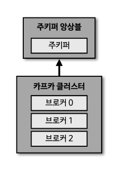
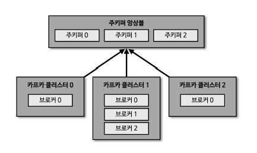

# kafka-study

## Kafka: Data-Pipeline

### 1. 높은 처리량

동일한 양의 데이터를 보낼 때, 네트워크 통신 횟수를 최소한으로 줄이면 동일 시간 내에 더 많은 데이터 전송 가능

- 카프카는 많은 양의 데이터를 배치 처리하여, 빠르게 대용량 실시간 로그 데이터 처리에 적합
- 파티션 단위를 통해 동일 목적 데이터를 여러 파티션에 분배하고 병렬처리할 수 있다
- 파티션 개수만큼 컨슈머 개수를 늘려서 동일 시간당 처리량을 늘린다

### 2. 확장성

데이터가 얼마나 들어올지 예측하기 어렵다

- 카프카는 가변적인 환경에서 안정적으로 확장 가능
- 데이터가 많아지면 클러스터의 브로커 개수를 스케일 아웃할 수 있다
- 반대로 데이터가 적어지면 브로커 개수를 스케일 인 할 수 있다

### 3. 영속성

프로그램이 종료되어도 데이터는 남아있다

- 메모리가 아닌 파일시스템에 저장
- 운영체제에서 파일 I/O 성능 향상을 위해 `Page Cache` 영역을 메모리에 따로 생성하여 사용
- Page Cache 메모리 영역을 사용하여, 카프카가 한 번 읽은 파일 내용은 메모리에 저장시켰다가 다시 사용
- 어플리케이션 장애로 급작스럽게 종료되더라도 프로세스를 재시작하여 안전하게 데이터 다시 처리

### 4. 고가용성

카프카 클러스터는 3개 이상의 서버(브로커)들로 운영됨

- 여러 브로커는 데이터 replication 되어 있다.
- 1 대의 브로커에 장애가 발생해도 다른 브로커에서 데이터 처리 가능
- on-premise 서버 랙, public-cloud Region 단위 장애에 대비한 브로커 옵션 존재

  
  

카프카는 기본적으로 토픽이라는 DB의 Table과 같은 개념이 있으며,
이 토픽에는 1개 이상의 파티션을 가진다. 이 파티션에 데이터가 저장된다.

--- 

## Kafka Ecosystem

  

- 토픽에 저장된 데이터를 처리해서 다시 토픽에 넣을 때 `Streams` 라이브러리 활용
- `Connect`는 데이터 파이프라인을 운영하는 핵심 툴
  - `Source Connect`는 프로듀서 역할
  - `Synk Connect`는 컨슈머 역할
- 왜 프로듀서나 컨슈머가 아닌 `Connector`를 사용하는가?
  - 커넥터는 `Cluster`로 운영한다
  - 파이프라인을 `Template` 형태로 여러 번 생서할 수 있으며, 함게 운영할 수 있다.
  - 프로듀서와 컨슈머를 개별로 만들어 배포하는 것보다 효율적이다.

## Kafka Broker & Cluster

  

`Zookeeper`: 카프카 클러스토러를 운영하기 위해 필수로 필요한 애플리케이션

하나의 서버에는 일반적으로 한 개의 브로커 프로세스가 실행된다.
- 보통 3대 이상의 서버를 한 개의 클러스터로 묶어서 운영하는 것이 일반적이다.

### Zookeeper Ensemble

  

여러 종류의 클러스터를 다양하게 동시에 운영할 수 있다.

### Broker의 역할

1. Controller
클러스터의 다수 브로커 중 한 대가 컨트롤러의 역할을 한다.
컨트롤러는 다른 브로커들의 상태를 체크하고 브로커가 클러스터에서 빠지는 경우 해당 브로커에 존재하는 리더 파티션을 재분배한다.

> 브로커에 장애가 생겼을 때, 장애 브로커를 제외하고 다른 팔로우 파티션이 리더 파티션을 승급받는다.

컨트롤러 브로커에 장애가 생기면 다른 브로커가 컨트롤러 역할을 맡는다.

- 브로커 : 클러스터에서 메세지를 저장하고 클라이언트와 통신하는 서버
- 파티션 : 토픽을 나눈 메세지 저장 단위로, 각 브로커에 할당되어 데이터의 분산 저장과 처리 가능

2. Data Deletion

다른 MQ와 다르게, 카프카는 컨슈머가 데이터를 가져가더라도 토픽 데이터가 삭제되지 않는다.
또한 컨슈머나 프로듀서가 데이터 삭제를 요청할 수도 없다.
오직 <U>브로커만 데이터를 삭제할 수 있다.</U> (`로그 세그먼트` 단위)

> 정책적 로직을 통한 삭제(원하는 것을 삭제 X)
일정 시간 혹은 용량, 혹은 `compact`(최신 메세지 키 있는 레코드를 제외하고 나머지 삭제)

3. Consumer Offset 저장
컨슈머가 어느 오프셋까지 처리했음을 알려주는 것을 커밋이라고 한다.
커밋을 통해서 컨슈머의 오프셋을 `__consumer_offsets` 토픽에 저장한다.

> 카프카를 생성하고 컨슈머를 생성하여 컨슈머 그룹 운영 시 커밋 이후에 자동으로 생성된다. (internal topic)

4. Group Coordinator
컨슈머 그룹의 상태를 체크하고 파티션을 컨슈머와 매칭되도록 분배
파티션 : 컨슈머는 1:1 매핑, 특정 파티션 문제 발생하면 해당 컨슈머는 삭제하고
컨슈머 한 대가 여러 파티션을 가져와서 데이터 처리 -> `Rebalance`