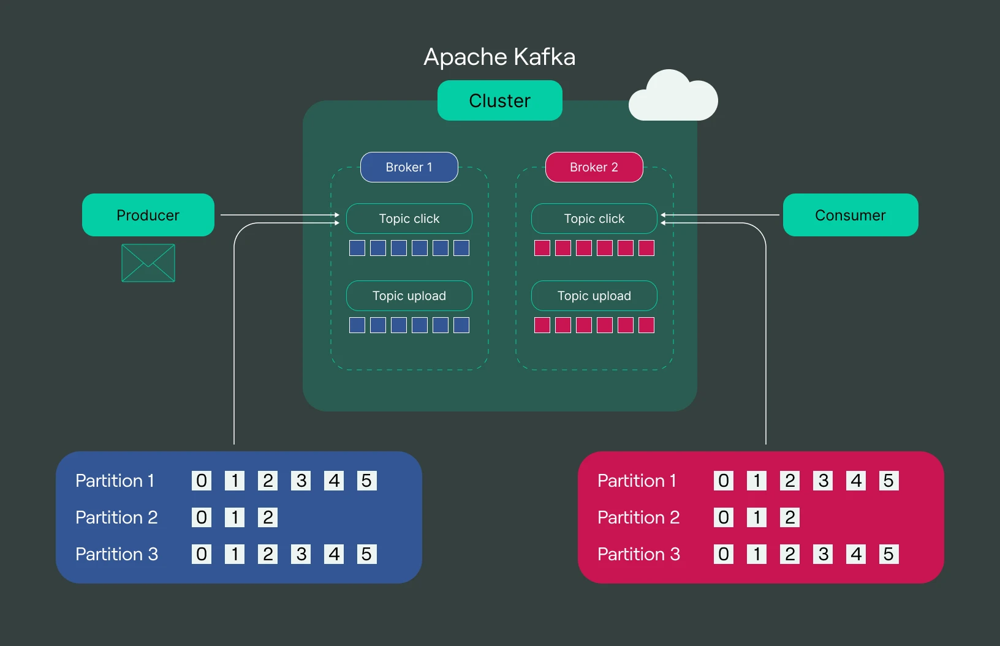
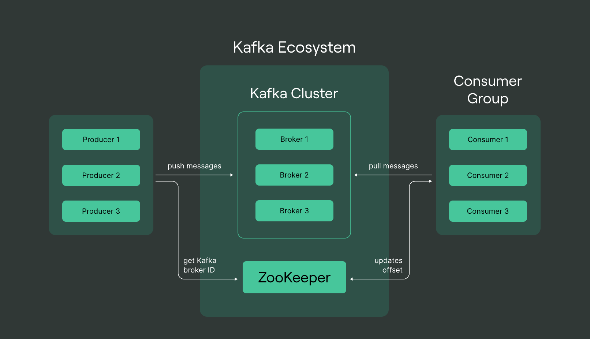
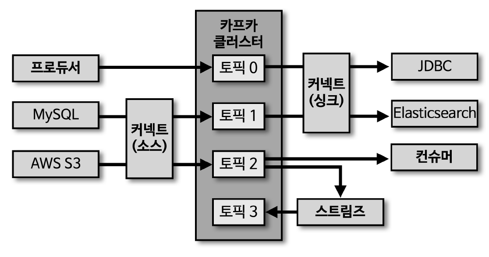

# kafka-study

## Kafka: Data-Pipeline

### 1. 높은 처리량

동일한 양의 데이터를 보낼 때, 네트워크 통신 횟수를 최소한으로 줄이면 동일 시간 내에 더 많은 데이터 전송 가능

- 카프카는 많은 양의 데이터를 배치 처리하여, 빠르게 대용량 실시간 로그 데이터 처리에 적합
- 파티션 단위를 통해 동일 목적 데이터를 여러 파티션에 분배하고 병렬처리할 수 있다
- 파티션 개수만큼 컨슈머 개수를 늘려서 동일 시간당 처리량을 늘린다

### 2. 확장성

데이터가 얼마나 들어올지 예측하기 어렵다

- 카프카는 가변적인 환경에서 안정적으로 확장 가능
- 데이터가 많아지면 클러스터의 브로커 개수를 스케일 아웃할 수 있다
- 반대로 데이터가 적어지면 브로커 개수를 스케일 인 할 수 있다

### 3. 영속성

프로그램이 종료되어도 데이터는 남아있다

- 메모리가 아닌 파일시스템에 저장
- 운영체제에서 파일 I/O 성능 향상을 위해 `Page Cache` 영역을 메모리에 따로 생성하여 사용
- Page Cache 메모리 영역을 사용하여, 카프카가 한 번 읽은 파일 내용은 메모리에 저장시켰다가 다시 사용
- 어플리케이션 장애로 급작스럽게 종료되더라도 프로세스를 재시작하여 안전하게 데이터 다시 처리

### 4. 고가용성

카프카 클러스터는 3개 이상의 서버(브로커)들로 운영됨

- 여러 브로커는 데이터 replication 되어 있다.
- 1 대의 브로커에 장애가 발생해도 다른 브로커에서 데이터 처리 가능
- on-premise 서버 랙, public-cloud Region 단위 장애에 대비한 브로커 옵션 존재

  
  

--- 

## Kafka Ecosystem

  

- 토픽에 저장된 데이터를 처리해서 다시 토픽에 넣을 때 `Streams` 라이브러리 활용
- `Connect`는 데이터 파이프라인을 운영하는 핵심 툴
  - `Source Connect`는 프로듀서 역할
  - `Synk Connect`는 컨슈머 역할
- 왜 프로듀서나 컨슈머가 아닌 `Connector`를 사용하는가>?
  - 커넥터는 `Cluster`로 운영한다
  - 파이프라인을 `Template` 형태로 여러 번 생서할 수 있으며, 함게 운영할 수 있다.
  - 프로듀서와 컨슈머를 개별로 만들어 배포하는 것보다 효율적이다.